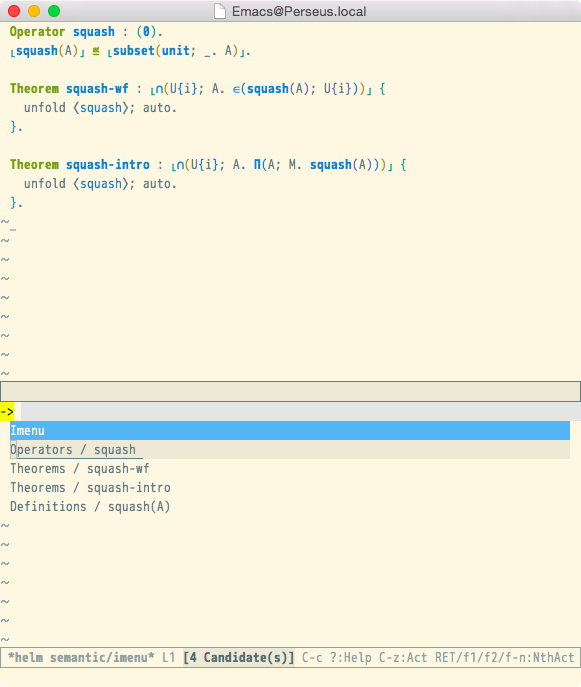

JonPRL is a proof refinement logic in the sense of λ-PRL or
[Nuprl](http://www.nuprl.org); JonPRL inherits its [computational type
theory](http://www.sciencedirect.com/science/article/pii/S1570868305000704)
from Allen, Bickford, Constable, Harper and many other names.

### Building & Installing JonPRL

JonPRL uses SML/NJ's [CM](http://www.smlnj.org/doc/CM/) for its build.  First
make sure you have SML/NJ set up properly. Then, install JonPRL's dependencies:

```sh
git submodule init
git submodule update
```

Then, JonPRL may be built using its `Makefile`:

```sh
make smlnj
make test
```

This puts a binary in `./bin/jonprl`. Optionally, you may install JonPRL globally using:

```sh
sudo make install
```

### Running JonPRL

To run JonPRL, simply direct it at your development:

```sh
jonprl example/test.jonprl
```

You may specify as many files as you like in this command; they will be refined
in order, in case of any dependencies.

#### Emacs Mode

Optionally, you may install the [JonPRL Mode for
Emacs](https://github.com/david-christiansen/jonprl-mode).

If you use `pretty-mode`, then you may install the following patterns:

```elisp
(pretty-add-keywords
  'jonprl-mode
  '(("\\\[" . "⸤")
    ("\\\]" . "⸥")
    ("<" . "⟨")
    (">" . "⟩")
    ("<>" . "⬧")
    ("\\<\\(=def=\\)\\>" . "≝")
    ))
```



### Basic Syntax

JonPRL has a two-level syntax. There is the syntax of terms in the underlying
lambda calculus (the object language) and the syntax of tactics and definitions
in the metalanguage. Terms from the underlying lambda calculus are embedded
into the metalanguage using brackets (`[` and `]`). When referring to names
from the object language in the metalanguage, they are quoted in angle brackets
(`<` and `>`).

The syntax of the object language represents all binders in a
consistent manner. The variables to be bound in a subterm are written
before it with a dot. For example, the identity function is written
`λ(x.x)` where the first `x` indicates the bound name and the second
refers back to it, and the first projection of a pair `P` is written
`spread(P; x.y.x)`. The semicolon separates arguments to `spread`.

